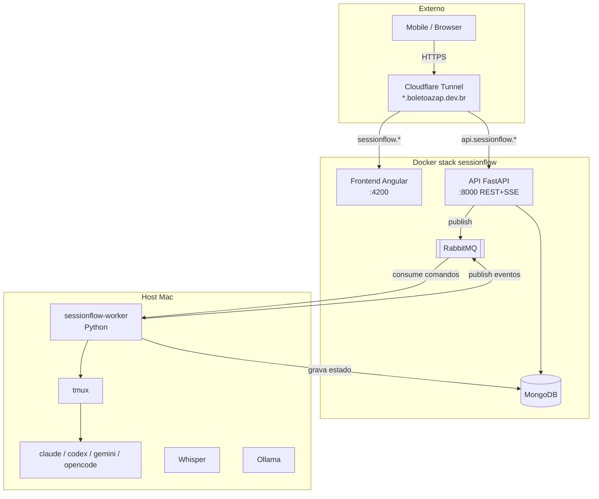

# Architecture

**Pattern:** Worker no host + serviços em Docker, desacoplados por fila. tmux como fonte de verdade.
*Forward-looking (greenfield) — reflete o design decidido, ainda sem código.*

## High-Level Structure

## Identified Patterns

### Worker-on-host, services-in-Docker
**Location:** `worker/` (host) vs `docker-compose.yml` (API/Front/Mongo/Rabbit)
**Purpose:** Worker precisa de tmux/Whisper/Ollama do host (AD-002); resto isola em containers.
**Implementation:** Worker conecta em `127.0.0.1:27017/5672`; API conecta por nome de serviço.

### Fila como fronteira (AD-005)
**Purpose:** Desacoplar API (container) ↔ Worker (host) sem o Worker abrir portas.
**Implementation:** exchange `sessionflow` (direct); `sessionflow.commands` (API→Worker), `sessionflow.events` (Worker→API). Ack manual, idempotência por `command_id`.

### tmux como fonte de verdade (AD-001)
**Purpose:** Estado real sempre lido do tmux; Mongo é cache/histórico.
**Implementation:** discovery loop ≤5s reconcilia tmux → Mongo; descobre sessões externas.

## Data Flow

### Comando de ciclo de vida (criar/encerrar/renomear/retomar)
`Frontend → API (REST) → publish sessionflow.commands → Worker consome → tmux op → grava sessions (Mongo) → publish sessionflow.events → API → (SSE futuro) → Frontend`

### Output (feature futura)
`Agent → tmux pane → Worker capture → publish events → API → Mongo + SSE → Frontend`

### Áudio (Fase 2)
`Mobile → upload API → storage → Worker → Whisper → texto → tmux send-keys`

## Code Organization

**Approach:** por componente físico (worker / api / frontend), cada um com camadas internas.

**Module boundaries:**
- `worker/` — runtime tmux, discovery, launcher, scanner, consumers (host)
- `api/` — routers, publishers, repositórios Mongo (container)
- `frontend/` — app Angular (container)
- `docker/` — init scripts (ex: mongo-init.js)
- `.specs/` — planejamento (spec-driven)
