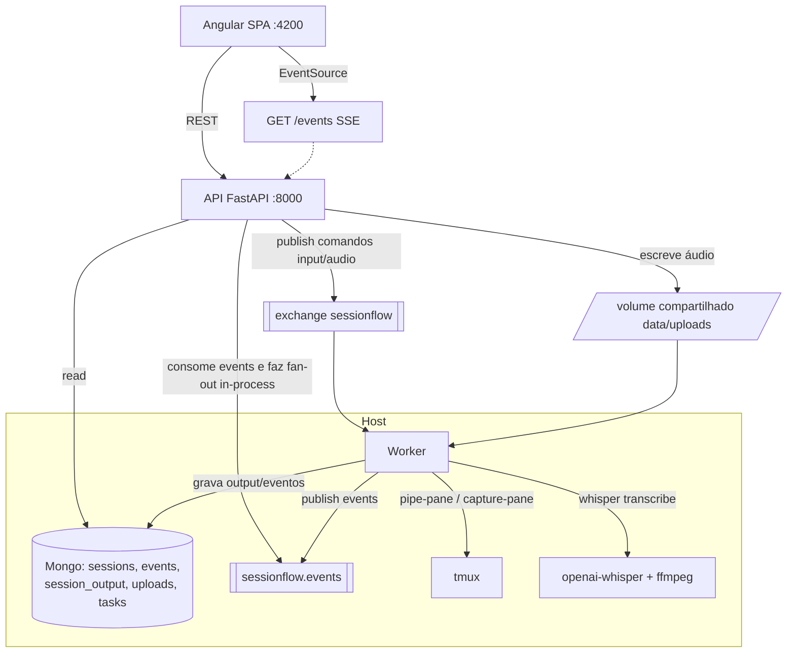

# Dashboard Mobile-First + SSE — Design

**Spec**: `.specs/features/dashboard-sse/spec.md`
**Status**: Draft
**UI contract**: `ui_mock/SessionFlow.dc.html` + `ui_mock/_ds/` (Prata Digital DS). Cores/estados/listas de modelo abaixo são extraídos do mockup.

---

## Architecture Overview

Acrescenta 4 capacidades à base existente (Worker + API de ciclo de vida): **captura de output**, **eventos**, **SSE**, **input (texto/áudio)**. O frontend Angular consome a API por REST + um stream SSE.



**Tempo real (decisão-chave):** o Mongo é **standalone** (1 container) → **não tem change streams**. Logo o SSE NÃO usa change streams. A API roda **um consumer de fundo** de `sessionflow.events` e faz **fan-out in-process** para cada cliente SSE (fila asyncio por conexão). Eventos também são persistidos (pelo Worker) para histórico/timeline.

---

## Code Reuse Analysis

| Componente | Local | Como usar |
| --- | --- | --- |
| `command_publisher.publish_command` | `api/app/publishers/` | Publicar novos comandos `input` e `audio` |
| `CommandConsumer` | `worker/.../command_consumer.py` | Estender com handlers `input` e `audio` |
| `TmuxRuntime` | `worker/.../tmux_runtime.py` | `send-keys` (input/transcrição); `capture-pane`/`pipe-pane` (output) |
| `rabbit` (topologia) | `worker/.../rabbit.py` | Reusar exchange/filas `sessionflow.*` |
| `SessionsRepository` / routers | `api/app/` | Estender com input/audio + leitura de output/eventos |
| sessions/discovery | worker | Estados semânticos (`waiting_input`/`completed`) refinados pela captura |

### Integration Points
| Sistema | Método |
| --- | --- |
| Mongo (standalone) | leitura via motor; SSE NÃO usa change streams (sem replica set) |
| RabbitMQ | comandos `input`/`audio`; eventos consumidos pela API p/ SSE |
| Whisper | `openai-whisper` (módulo Python) no Worker, via `run_in_executor` (não bloquear loop) |
| Áudio storage | bind-mount host `./data/uploads` ↔ container API `/data/uploads`; Worker lê do host |

---

## Components — Backend

### Worker: `output_capture.py`
- **Purpose**: capturar output dos panes e emitir linhas novas.
- **Interfaces**: `start_capture(session)` (usa `tmux pipe-pane -o 'cat >> <file>'`), `poll_new_lines()` (tail/diff), `classify_line(text) -> type` (cmd/sys/agent/tool/out/ask — cores do mockup), `detect_waiting(text, agent) -> bool`.
- **Saída**: persiste em `session_output` + publica evento `output` em `sessionflow.events`.
- **Estado semântico**: ao detectar pergunta/decisão (heurística por agente) → marca `waiting_input` + evento `attention`. ⚠️ heurística por CLI a validar empiricamente.

### Worker: `transcriber.py`
- **Purpose**: transcrever áudio via Whisper.
- **Interfaces**: `transcribe(path) -> str` (carrega modelo configurável, default `base`; roda em executor).
- **Dependências**: `whisper`, `ffmpeg`.

### Worker: `command_consumer` (estender)
- Novos handlers: `input` (`send-keys` do texto) e `audio` (transcreve via `transcriber` → `send-keys` → evento `input` com o texto).

### API: `routers/events.py` (SSE)
- `GET /events?session=` → `StreamingResponse` text/event-stream; headers `Cache-Control: no-cache`, `X-Accel-Buffering: no`, `Connection: keep-alive`; heartbeat `: ping` a cada 20s; suporta `Last-Event-ID`.
- Background: `EventsBroker` (singleton) — 1 consumer de `sessionflow.events` → fan-out p/ filas asyncio dos clientes.

### API: `routers/sessions.py` (estender)
- `POST /sessions/{id}/input` → publica comando `input`.
- `POST /sessions/{id}/audio` (multipart) → salva em `/data/uploads`, registra `uploads`, publica comando `audio`.
- `GET /sessions/{id}/output?after=<seq>` → linhas do terminal (paginado).

### API: `routers/events.py` + `routers/tasks.py`
- `GET /events/history?day=` → timeline agrupável.
- `GET /notifications` → notificações (derivadas de events kind attention/info/warning/success).
- `GET /tasks?session=` → tarefas (se existirem).

---

## Components — Frontend (Angular)

Estrutura espelhando o mockup. Standalone components, signals, mobile-first, PWA.

```
frontend/src/app/
├── core/
│   ├── api.service.ts         # REST (sessions, directories, input, audio, output, events, tasks)
│   ├── sse.service.ts         # EventSource -> signals (reconexão c/ backoff)
│   ├── tokens.css             # importa tokens do Prata Digital DS
│   └── models.ts              # Session, EventItem, Notification, Directory, Task
├── shell/                     # app-shell + bottom-nav + status bar
├── features/
│   ├── inicio/                # DASH-05
│   ├── sessoes/               # DASH-06 (+ filtros)
│   ├── timeline/              # DASH-10
│   ├── responder/             # DASH-13 (texto + áudio)
│   ├── perfil/                # DASH-11
│   ├── detalhe/               # DASH-08 (terminal SSE + métricas)
│   ├── criar/                 # DASH-07 (overlay)
│   └── notificacoes/          # DASH-09 (overlay)
└── shared/                    # session-card, status-pill, agent-badge, etc.
```

**Contrato visual (do mockup):**
- Agentes: claude `CC #D97757`, codex `Cx #10A37F`, gemini `G #4796E3`, opencode `OC #06B6D4`.
- Estados→cor: running/completed `#34D399`, waiting_input `#FBBF24`, waiting_external `#FB923C`, error `#F87171`, stopped `#6B7280`, detached `#9AA0AE`.
- Modelos por agente, esforços (Baixo/Médio/Alto/Máximo), filtros (Todas/Ativas/Aguardando/Concluídas/Detached): conforme mockup.
- Tema dark (`#0E1113`), accent mint `#00E4B4`, Inter + JetBrains Mono (terminal).
- **Áudio**: `MediaRecorder` no `responder/` e no input do `detalhe/`; indicador de gravação; upload multipart.

---

## Data Models (Mongo)

```typescript
interface EventDoc {           // events
  _id; session_id: string|null; type: 'created'|'output'|'waiting'|'completed'|'killed'|'detached'|'input'|'error';
  kind: 'attention'|'info'|'warning'|'success'; title: string; desc: string; at: Date; seq: number;
}
interface OutputLine {         // session_output (capped ou com TTL/ring por sessão)
  _id; session_id: string; seq: number; text: string; line_type: 'cmd'|'sys'|'agent'|'tool'|'out'|'ask'; at: Date;
}
interface UploadDoc {          // uploads
  _id; session_id: string; path: string; kind: 'audio'; status: 'received'|'transcribing'|'done'|'error';
  transcript: string|null; created_at: Date;
}
interface TaskDoc {            // tasks (opcional nesta feature)
  _id; session_id: string; title: string; state: 'todo'|'doing'|'blocked'|'done'|'attention'; updated_at: Date;
}
```
Índices: `events` (session_id, at desc, seq), `session_output` (session_id, seq).

---

## Error Handling

| Cenário | Tratamento | UX |
| --- | --- | --- |
| SSE cai (timeout Cloudflare ~100s) | heartbeat 20s + reconexão c/ backoff no cliente | reconecta transparente |
| Whisper falha | evento `error`, upload status `error` | toast "falha na transcrição" |
| Mic negado | erro de permissão | mensagem clara |
| Output gigante | ring buffer (cap N linhas) no Mongo e no front | scroll, sem travar |
| Métrica indisponível (DASH-12) | exibe "—"/"indisponível" | nunca número fake |
| API/Worker offline | banner offline; ações desabilitadas | gracioso |

---

## Tech Decisions

| Decisão | Escolha | Racional |
| --- | --- | --- |
| Tempo real | SSE + consumer Rabbit + fan-out in-process | Mongo standalone não tem change streams |
| Captura de output | `tmux pipe-pane` (stream) + persistência incremental | mais real-time que polling de capture-pane |
| Áudio transporte | bind-mount `data/uploads` (host↔API) + path no comando | evita base64 gigante na fila |
| Whisper | `openai-whisper` modelo `base` em executor | já instalado; não bloqueia o loop async |
| Frontend | Angular standalone + signals + PWA | mobile-first, PWA p/ Lighthouse |
| Estado de input | reusa canal de comandos `sessionflow.commands` (tipos `input`/`audio`) | reaproveita consumer existente |

---

## Open Questions (resolver na implementação)
1. Heurística de `waiting_input`/`completed` por CLI (claude/codex/gemini/opencode) — validar com sessões reais.
2. Modelo Whisper (tiny/base/small) — medir latência no host.
3. DASH-12 métricas: investigar fontes por CLI no momento da task (degradar se não houver) — **não fabricar**.
4. Capped collection vs TTL para `session_output` (tamanho do ring buffer).
