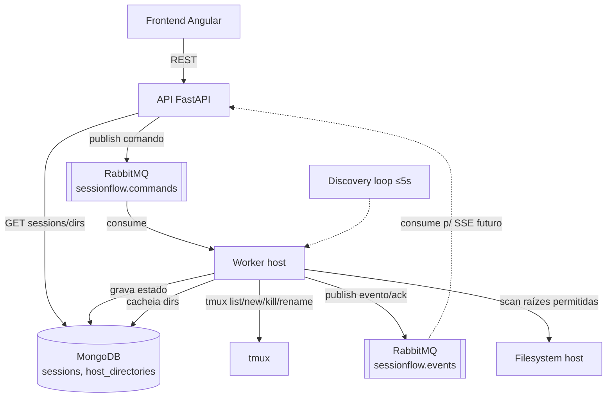

# tmux Runtime & Discovery — Design

**Spec**: `.specs/features/tmux-runtime-discovery/spec.md`
**Status**: Draft

---

## Architecture Overview

O **Worker (Python, no host)** é o único componente que fala com o `tmux`. A **API (FastAPI, em container)** nunca toca o tmux — ela só publica comandos no RabbitMQ e lê estado do MongoDB. O Worker reconcilia o tmux para o Mongo num loop periódico; comandos de ciclo de vida (criar/encerrar/renomear/retomar) seguem via fila.



**Por que o Worker no host:** AD-002 — precisa de `tmux`/Whisper/Ollama locais. A API em container não tem o tmux.

**Por que fila e não HTTP direto Worker↔API:** AD-005 — desacopla a fronteira host↔container; o Worker não precisa abrir porta nem ser alcançável pela rede do Docker.

---

## Code Reuse Analysis

Projeto greenfield — nada a reusar ainda. Estabelece os padrões-base.

### Integration Points

| Sistema | Método de integração |
| --- | --- |
| MongoDB (stack local) | `motor` (async) via `MONGO_URI_HOST` (Worker, `127.0.0.1`) e `MONGO_URI` (API, rede docker) |
| RabbitMQ (stack local) | `aio-pika` via `RABBITMQ_URI_HOST` (Worker) / `RABBITMQ_URI` (API) |
| tmux | `libtmux` (wrapper Pythônico) com fallback a `subprocess` para casos não cobertos |
| CLIs de agente | `subprocess`/`send-keys` montando o comando de launch por tipo (ver tabela) |

---

## Components

### Worker — `tmux_runtime`

- **Purpose**: Encapsular todas as operações tmux (a única porta de entrada para o tmux).
- **Location**: `worker/sessionflow_worker/tmux_runtime.py`
- **Interfaces**:
  - `list_sessions() -> list[TmuxSession]` — `tmux list-sessions` + metadados (attached, created, id).
  - `new_session(name, work_dir) -> TmuxSession` — `tmux new-session -d -s <name> -c <dir>`.
  - `kill_session(name) -> None` — `tmux kill-session -t <name>`.
  - `rename_session(old, new) -> None` — `tmux rename-session`.
  - `has_session(name) -> bool` — `tmux has-session`.
  - `pane_command(name) -> str` / `pane_pid(name) -> int` — inferência de agente/estado.
  - `is_attached(name) -> bool` — clients anexados.
- **Dependencies**: `libtmux`, tmux instalado.
- **Reuses**: —

### Worker — `agent_launcher`

- **Purpose**: Montar o comando de inicialização de cada agente com modelo e esforço corretos.
- **Location**: `worker/sessionflow_worker/agent_launcher.py`
- **Interfaces**:
  - `build_launch_cmd(agent_type, model, effort) -> str` — retorna a linha a enviar via `send-keys`.
  - `infer_agent_type(pane_command) -> AgentType | "desconhecido"`.
- **Dependencies**: tabela de flags (abaixo).
- **Nota de incerteza**: a flag de effort do **codex** (`-c model_reasoning_effort=<level>`) é override de config — **confirmar a chave** contra `~/.codex/config.toml` na implementação. **Gemini não tem flag de effort** → ignorar o campo para gemini.

#### Tabela de flags (verificada via `--help` em 2026-06-16)

| Agente | cmd base | Modelo | Esforço |
| --- | --- | --- | --- |
| claude | `claude` | `--model <model>` | `--effort <baixo→low...>` (mapear rótulos PT→nível da CLI) |
| codex | `codex` | `-m <model>` | `-c model_reasoning_effort=<level>` ⚠️ confirmar chave |
| gemini | `gemini` | `-m <model>` | — (sem flag; campo ignorado) |
| opencode | `opencode` | `-m <provider/model>` | `--variant <high\|...>` |

> Mapeamento dos rótulos do mockup (Baixo/Médio/Alto/Máximo) → valores aceitos por cada CLI: definir na implementação a partir do `--help`/docs de cada uma. Não inventar valores.

### Worker — `discovery`

- **Purpose**: Loop periódico (≤5s) que reconcilia tmux → Mongo.
- **Location**: `worker/sessionflow_worker/discovery.py`
- **Interfaces**:
  - `run_forever(interval=5)` — varre `list_sessions()`, faz upsert em `sessions`, marca sumidas como `stopped`, infere tipo/estado.
  - `reconcile_once() -> ReconcileReport`.
- **Dependencies**: `tmux_runtime`, `state`, `mongo`.
- **Concorrência**: lock (asyncio.Lock) para não rodar dois ciclos simultâneos (edge case da spec).

### Worker — `state`

- **Purpose**: Derivar o estado da sessão de forma determinística.
- **Location**: `worker/sessionflow_worker/state.py`
- **Interfaces**: `derive_state(tmux_present, attached, agent_alive, exit_code) -> SessionState`.
- **Escopo**: só os determinísticos nesta feature — `running` / `detached` / `stopped` / `error`. `waiting_input`/`waiting_external`/`completed` ficam para a feature de captura de output (dependem de ler o pane).

### Worker — `dir_scanner`

- **Purpose**: Varrer raízes permitidas e cachear diretórios no Mongo para o autocomplete.
- **Location**: `worker/sessionflow_worker/dir_scanner.py`
- **Interfaces**: `scan() -> int` (upsert em `host_directories`), roda no boot e a cada N min.
- **Raízes permitidas** (config): default `~/dev`, `~/work` — nunca varrer o FS inteiro (TMUX-08 AC4). Profundidade limitada (ex: 3 níveis).
- **Decisão**: autocomplete lê do **Mongo** (não RPC por tecla) → latência baixa no typeahead.

### Worker — `command_consumer`

- **Purpose**: Consumir `sessionflow.commands` e despachar para a operação tmux correta.
- **Location**: `worker/sessionflow_worker/command_consumer.py`
- **Interfaces**: `handle(command: Command)` → valida, executa via `tmux_runtime`, grava em `sessions`, publica ack em `sessionflow.events`.
- **Entrega**: ack manual (at-least-once); idempotência por `command_id`.

### API — `sessions` router

- **Purpose**: Endpoints REST de ciclo de vida + leitura de estado + autocomplete.
- **Location**: `api/app/routers/sessions.py`, `api/app/routers/directories.py`
- **Interfaces**:
  - `POST /sessions` → valida {name, agent_type, work_dir, model, effort}, checa duplicidade/dir, publica comando `create`. `202 Accepted`.
  - `DELETE /sessions/{id}` → publica `kill`.
  - `PATCH /sessions/{id}` (rename) → publica `rename`.
  - `POST /sessions/{id}/resume` → publica `resume`.
  - `GET /sessions` (+filtros) / `GET /sessions/{id}` → lê do Mongo.
  - `GET /directories?q=<termo>` → prefix-filter em `host_directories` (limit N).
- **Dependencies**: `motor`, `aio-pika`.
- **Validação**: nome duplicado e diretório inexistente são checados de forma assíncrona (estado real vem do Worker); a API faz checagem otimista contra o Mongo e o Worker reconfirma (rejeita via evento de erro se mudou).

---

## Data Models

### `sessions` (MongoDB)

```typescript
interface SessionDoc {
  _id: ObjectId
  tmux_name: string          // nome no tmux (sanitizado: sem ':' '.')
  display_name: string       // nome amigável escolhido pelo usuário
  agent_type: 'claude' | 'codex' | 'gemini' | 'opencode' | 'desconhecido'
  model: string | null       // ex: 'Sonnet 4.5'
  effort: string | null      // null para gemini
  work_dir: string
  status: 'running' | 'waiting_input' | 'waiting_external' | 'completed' | 'error' | 'stopped' | 'detached'
  origin: 'sessionflow' | 'externa'
  tmux_session_id: string | null
  agent_pid: number | null
  last_exit_code: number | null
  created_at: Date
  updated_at: Date
  last_seen_at: Date         // última vez vista na discovery
}
```

**Índices**: `tmux_name` (único parcial p/ vivas), `status`, `updated_at`.
**Relationships**: `events`/`tasks`/`feedbacks` (features futuras) referenciam `_id`.

### `host_directories` (MongoDB)

```typescript
interface HostDirDoc {
  path: string     // '~/dev/portal-tomador'  (chave única)
  parent: string   // '~/dev/'
  name: string     // 'portal-tomador'
  root: string     // '~/dev'
  scanned_at: Date
}
```

### Mensagens RabbitMQ

```typescript
// sessionflow.commands  (API -> Worker)
interface Command { command_id: string; type: 'create'|'kill'|'rename'|'resume'; payload: object; requested_at: string }
// sessionflow.events   (Worker -> API)  — base para SSE na feature seguinte
interface Event { event_id: string; session_id: string|null; type: string; ok: boolean; data: object; at: string }
```

**Topologia** (AD-010, isolamento por prefixo): exchange `sessionflow` (direct); filas `sessionflow.commands`, `sessionflow.events`. vhost `/`.

---

## Error Handling Strategy

| Cenário | Tratamento | Impacto p/ usuário |
| --- | --- | --- |
| tmux não instalado | Worker loga e publica evento `runtime_unavailable`; não crasha | UI mostra "runtime indisponível" |
| Nome duplicado no create | API rejeita otimista; se passar, Worker rejeita e publica `error` | Erro "nome duplicado" |
| Diretório inexistente | Worker valida antes do `new-session`; publica `error` | Erro "diretório inexistente" |
| Operação em sessão que sumiu | Worker reconcilia p/ `stopped` e responde `error: sessão inexistente` | UI atualiza p/ Encerrada |
| Nome com `:`/`.` | Sanitiza p/ tmux_name; mantém display_name original | Transparente |
| Agente desconhecido (externa) | `agent_type='desconhecido'`, segue listando | Badge "desconhecido" |
| Mongo/Rabbit indisponível | Retry com backoff; comando fica na fila (não anexado) até reprocessar | Operação atrasa, não se perde |
| Dois ciclos de discovery | `asyncio.Lock` serializa | Transparente |
| Exit code do agente | Detectar via pane-dead/`remain-on-exit` ou checagem do PID; se ≠0 → `error` | Status "Erro" |

---

## Tech Decisions

| Decisão | Escolha | Racional |
| --- | --- | --- |
| Acesso ao tmux | `libtmux` + fallback `subprocess` | API Pythônica testável; subprocess cobre lacunas |
| Cliente Mongo | `motor` (async) | Worker e API são async-first |
| Cliente RabbitMQ | `aio-pika` | async, ack manual, robusto |
| Autocomplete de dir | cache no Mongo (não RPC por tecla) | Latência baixa no typeahead; dirs mudam pouco |
| Detecção de exit code | `set -g remain-on-exit on` + inspeção de `pane_dead`/`pane_dead_status` | Forma confiável de capturar saída do agente no tmux |
| Validação de estado | otimista na API, autoritativa no Worker | tmux é a fonte de verdade (AD-001) |

> ⚠️ `remain-on-exit`/`pane_dead_status` a validar na implementação (tmux 3.6b) — não assumir comportamento sem testar.

---

## Open Questions (para resolver na implementação/Tasks)

1. Mapeamento exato dos rótulos PT (Baixo/Médio/Alto/Máximo) → valores de cada CLI.
2. Confirmar chave de config de effort do codex (`model_reasoning_effort`?).
3. Como o agente é "iniciado" no pane: `send-keys '<cmd>' Enter` logo após `new-session` — confirmar timing/escape.
4. Profundidade e raízes default do `dir_scanner` (sugerido `~/dev`, `~/work`, 3 níveis).
