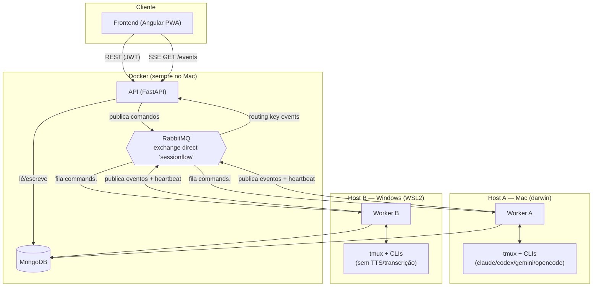
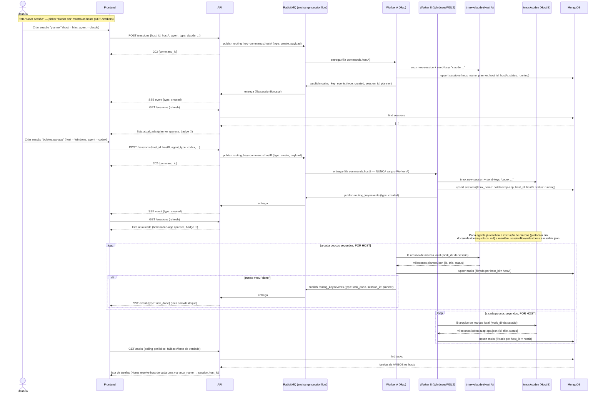

# Arquitetura do SessionFlow

Visão geral de como as peças do sistema se encaixam, com foco em **multi-host**
(AD-011): sessões podem rodar tanto no Mac quanto num segundo computador
(hoje, um Windows via WSL2), coexistindo no mesmo painel.

## Componentes

- **Frontend**: Angular PWA (Service Worker), fala só com a API — nunca
  diretamente com Mongo/RabbitMQ/worker.
- **API**: único ponto de escrita no Mongo e único publisher de comandos no
  RabbitMQ. Roda em Docker, sempre no Mac.
- **MongoDB / RabbitMQ**: rodam em Docker no Mac. Portas AMQP (5672) e Mongo
  (27017) publicadas na LAN (`0.0.0.0`), não só `127.0.0.1`, para que um
  worker rodando numa **outra máquina da rede** consiga se conectar
  diretamente (ver `docker-compose.yml` e `docs/multi-host-plan.md`).
- **Worker**: processo Python (`sessionflow_worker`) que **não roda em
  Docker** — precisa de acesso real a `tmux`, e no Mac também a
  Whisper/TTS/Ollama. Um worker roda por host: hoje, um no Mac (via
  `launchd`) e um no Windows/WSL2 (via `systemd`, com WSL2 configurado pra
  subir sozinho no logon via Task Scheduler). Cada worker fala com o CLI de
  agente real (`claude`/`codex`/`gemini`/`opencode`) dentro de um pane tmux.

## Identidade e capacidades de host (AD-011)

Cada worker, ao subir, resolve:

- **`host_id`**: UUID persistido em `~/.claude/.sessionflow-host-id` — gerado
  uma vez, sobrevive a restarts do worker.
- **`platform`**: `darwin` | `wsl2` | `linux` | `windows` (detecta WSL2 via
  `/proc/version`).
- **`capabilities`**: `{ tts, transcription, open_terminal }` — hoje só
  `darwin` tem as três `True` (a menos que `SESSIONFLOW_JARVIS_TTS=api` force
  TTS cross-platform). Um host Windows/WSL2 expõe sessões/terminal normais,
  mas sem JARVIS (voz), sem transcrição de áudio e sem o botão "abrir no Mac".

O worker registra isso em `worker_status` (upsert por `_id=host_id`) a cada
heartbeat. A API expõe `GET /workers` com essa lista; o frontend usa
(`WorkersStore`) pra:
- decidir se mostra badge de host (só quando há **mais de 1** host ativo);
- esconder botões de feature que o host da sessão não suporta
  (`supports(hostId, 'tts')` etc., fail-open quando não sabe);
- resolver nome/emoji do host pro badge.

## Comunicação API ↔ Worker (comandos)

Tudo passa pelo exchange **direct** durável `sessionflow` no RabbitMQ:

- **API → Worker** (comandos: `create`, `resume`, `kill`, `input`, `key`,
  `switch_agent`, ...): a API publica com a routing key
  `sessionflow.commands.<host_id>`. Cada worker declara e consome **só a
  fila do seu próprio host** (`sessionflow.commands.<host_id>`) — isso é o
  que garante que um comando de uma sessão do Host A nunca seja entregue ao
  worker do Host B (o RabbitMQ faria round-robin entre consumidores da MESMA
  fila; filas separadas por host eliminam esse risco por construção).
  O `host_id` de destino vem do documento da sessão (`sessions.host_id`); ao
  **criar** uma sessão nova, vem do body (`SessionCreate.host_id`, escolhido
  no picker "Rodar em" da tela Nova Sessão) ou, se omitido, do worker com
  `updated_at` mais recente em `worker_status` (auto-resolve).
- **Worker → API** (eventos: `created`, `stopped`, `task_done`, ...): todo
  worker publica no mesmo exchange com a routing key fixa
  `sessionflow.events` (não depende de host — é fan-out, não fila dedicada).
  A API declara/consome a fila `sessionflow.sse` bindada a essa routing key
  (`EventsBroker`) e re-distribui cada evento, em memória, para toda conexão
  SSE aberta (`GET /events`) — é assim que a Home recebe notificação/toast
  quase em tempo real sem que o worker precise saber quem está com o app
  aberto.

Além do canal de eventos (push), o frontend também **faz polling** —
`GET /sessions`, `GET /tasks` — como fonte de verdade e fallback caso a SSE
caia; o evento serve pra disparar refresh imediato/toast, não é a única via.

## Diagrama de sequência: criar 2 sessões em hosts diferentes + tarefas

Exemplo: o usuário cria uma sessão no Mac (Claude) e outra no Windows
(Codex), e depois cada agente reporta progresso via marcos (arquivo
`.sessionflow/milestones.<sessão>.json`, lido pelo worker do host onde a
sessão realmente roda).

Pontos-chave desse fluxo:

- O picker de host só decide **para qual fila** o comando `create` vai — a
  partir daí, tudo mais (resume, input, kill, tarefas) usa o `host_id`
  gravado no próprio documento da sessão, então nunca precisa ser escolhido
  de novo.
- **Tarefas não têm canal de rede próprio**: cada worker só lê o arquivo de
  marcos das sessões **do seu host** (filtro `host_id` no `milestones_loop`,
  necessário porque `work_dir` é um caminho de arquivo *local* — o worker do
  Mac não conseguiria ler um caminho que só existe no Windows, e vice-versa).
  O que sincroniza os dois hosts num painel só é o Mongo compartilhado.
- Eventos (`created`, `stopped`, `task_done`, ...) são **best-effort/push**
  para notificação rápida; a lista real sempre vem de `GET /sessions` e
  `GET /tasks` (polling), que já refletem os dois hosts porque leem do mesmo
  Mongo.

## Índices que garantem isolamento por host

- `sessions`: único composto em `(host_id, tmux_name)` — dois hosts podem ter
  uma sessão com o **mesmo nome** tmux sem colidir (índice antigo era só
  `tmux_name`).
- `host_directories` (autocomplete de diretório): único composto em
  `(host_id, path)` — o mesmo caminho relativo pode existir nos dois hosts
  (ex.: `~/projetos/x` no Mac e `/mnt/c/repo/x` no Windows) sem conflito, e o
  autocomplete da tela "Nova sessão" filtra por `host_id` do host selecionado.
